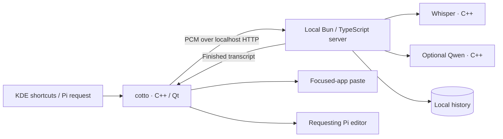

# cotto

cotto is a Linux-native, KDE/Wayland-focused fork of [Sotto](https://github.com/davis7dotsh/sotto).

## Intent

Dictate into the application you are already using, with local inference and a
small interface that stays out of the way. A compact menu opens microphone,
shortcut, engine, and personal-dictionary settings; closing it leaves dictation
available in the tray.

Your words belong to your user profile. Global dictation pastes into the focused
application; Pi-owned dictation returns only to its requesting editor. Neither
route presses Enter, submits a form, or automatically retries uncertain delivery.

## Architecture

The desktop is C++/Qt, not a browser shell. An independent Bun/TypeScript service
coordinates native C++ speech and optional cleanup helpers. No Swift, Xcode, or
macOS build tools are used.

See [Architecture](docs/architecture.md) for component ownership, recording flow,
process lifecycle, storage, and trust boundaries.

## Start here

- [Build and run the Linux app](Linux/README.md)
- [Set up the local inference server and models](Server/README.md)
- [Global dictation and its safety limits](docs/linux/GLOBAL-DICTATION.md)
- [Pi integration](docs/linux/PI-OWNED-DICTATION.md)
- [Tray, startup, and recovery](docs/linux/STARTUP.md)
- [Current status and remaining work](docs/linux/STATUS.md)
- [Testing](docs/linux/TESTING.md)

This is development software. KDE/Wayland is the supported desktop; other
compositors, a distributable desktop package, and the remaining physical acceptance
checks are not claimed complete. Models are downloaded explicitly, not committed.

The `sotto` executable, API, storage, and desktop identifiers remain where changing
them would break existing installations. The inherited macOS application and build
paths have been removed; vendored inference dependencies retain their upstream
source and notices.

[MIT](LICENSE) · [Third-party notices](THIRD_PARTY_NOTICES.md)
