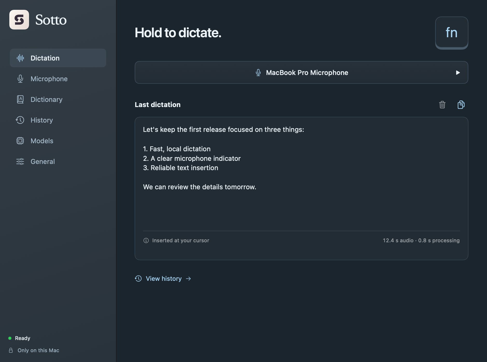
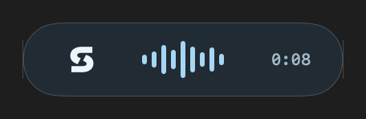
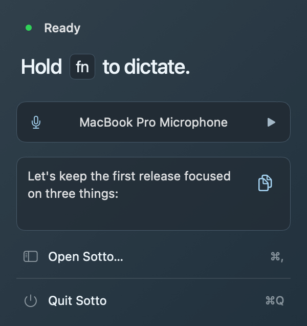
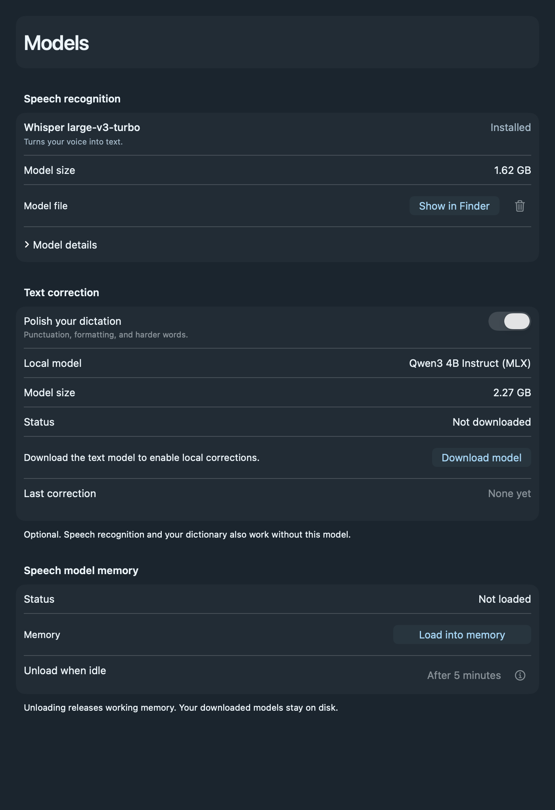

# Sotto

**Hold a key. Speak your mind. Keep it on your Mac.**

Sotto is a native, local-first dictation app for Apple Silicon. Hold your shortcut to record, release to transcribe, and your words appear at your cursor—or on your clipboard when no editable field is selected. No account, subscription, API key, or cloud inference.



Screenshots show native app views rendered with sample data.

## Dictation that stays out of the way

- **Hold to talk.** Choose Right Option, Right Control, or Fn/Globe. A compact floating indicator shows a live waveform and elapsed time. Hover to reveal the cancel button.
- **Keep working.** With Fn held, you can click, scroll, and switch apps without ending the recording. Delivery stays tied to the original field; it never follows your cursor into an unrelated destination.
- **Your microphones, in order.** Pick an input, follow the system default, or create named priority lists. Reconnecting a preferred microphone selects it for the next recording, never halfway through a take.
- **Names and lists, handled locally.** An always-active dictionary supplies preferred spellings. Spoken numbered and bulleted lists can continue across takes at the same confirmed cursor position.
- **History you own.** Browse past dictations, copy their text, and open the original recordings. Nothing is uploaded.



### One click from the menu bar

Close the main window and Sotto keeps running. The menu gives you the current state, a microphone test, and your last dictation to copy. Tests preview text inside Sotto without pasting elsewhere.



## Two local models, no server

Speech recognition uses **Whisper large-v3-turbo** through Metal-accelerated whisper.cpp. An optional **Qwen3-4B-Instruct-2507** proofreading pass runs natively through Swift MLX with 4-bit weights. It handles punctuation, formatting, and wording corrections after the dictionary and list formatter.



- Speech weights are approximately **1.62 GB**; the optional text model is **2.27 GB**. Downloads are explicit and integrity-checked.
- Text correction defaults on but requires its separate download. Disable it in **Models** to keep only speech recognition, dictionary rules, and list formatting.
- Models load on demand and unload after **five idle minutes** by default. Choose immediate unloading, fifteen minutes, or keeping them warm until quit.
- Once models are downloaded, transcription and correction work **offline**. The app needs no Python runtime or background HTTP server.

Correction is not infallible: conservative checks reject some risky rewrites, but cannot guarantee unchanged meaning. Review important text before sending.

## Build and try it

**Runtime target:** Apple Silicon; macOS 14 or newer. Liquid Glass is available on macOS 26+, with native material fallbacks on earlier versions.

**Build tools:** Xcode 26 or newer with the macOS 26+ SDK and Metal Toolchain, plus CMake (`brew install cmake`). Building fetches pinned source dependencies and a small voice-activity model.

```sh
git clone --recurse-submodules https://github.com/davis7dotsh/sotto.git
cd sotto

# Install if the Metal compiler is missing:
xcodebuild -downloadComponent MetalToolchain

./scripts/build-app.sh --install
open ~/Applications/Sotto.app
```

1. Download the speech model from **Models**, and the text model if you want proofreading.
2. Grant **Microphone** and **Accessibility** when prompted. Separate Input Monitoring permission is not required. Quit and reopen if macOS requests it.
3. Click into a text field, hold the shortcut shown on **Dictation**, speak, and release. **Right Option is the fresh-install default**; choose Fn/Globe or Right Control in **General**.

For Fn, set macOS **Keyboard → Press Globe key to → Do Nothing** if its system action conflicts. If Sotto is missing from Accessibility settings, add `~/Applications/Sotto.app` with the **+** button.

Quit Sotto before installing a replacement. Omit `--install` to build into `build/Sotto.app`. The script uses an existing Apple Development signing identity when exactly one is available; select one with `SOTTO_SIGNING_IDENTITY` when needed. Without a certificate it uses ad-hoc signing, so rebuilds may require granting permissions again. Builds are not notarized.

## Privacy and local files

- **Microphone:** opened only for a recording you start; no always-on listening. Takes are capped at three minutes.
- **Network:** explicit model downloads only at runtime. No telemetry, accounts, online transcription, or surrounding document/screen reading.
- **Settings:** `~/.murmur/config.json`. App edits save automatically; valid file edits update the running app.
- **History:** `~/.murmur/transcripts/`. Saving is on by default. Each take includes transcript text, JSON metadata, original audio, and the audio sent to Whisper. Turn future saving off in **General → History**; existing files remain until you delete them.
- **Models:** speech weights live in `~/Library/Application Support/Murmur/Models/`; text weights in `~/.murmur/models/`.

The older **Murmur** storage paths and bundle identifier are retained for compatibility. History files are private to your user, not additionally encrypted by Sotto. Clearing the last-dictation preview does not delete saved history.

Some editors do not expose enough accessibility information for reliable insertion. Sotto checks the original destination before writing, reports unconfirmed attempts, and uses clipboard or preview fallback when appropriate. If insertion is unconfirmed, check the destination before pasting again.

## Development

```sh
swift test
./scripts/smoke-test.sh       # Requires the built app and speech model
./scripts/test-corrections.sh # Also requires the downloaded text model
```

Open `Package.swift` for the Swift app and core library, and `TextEngine/Package.swift` for the MLX helper. Use the build script for a complete app bundle with its native engines and permissions metadata.

[Architecture](docs/architecture.md) · [Configuration](docs/configuration.md) · [Local history](docs/local-history.md) · [Text correction](docs/text-correction.md)

## License

[MIT](LICENSE). Bundled dependencies and model licenses are listed in [third-party notices](THIRD_PARTY_NOTICES.md).
