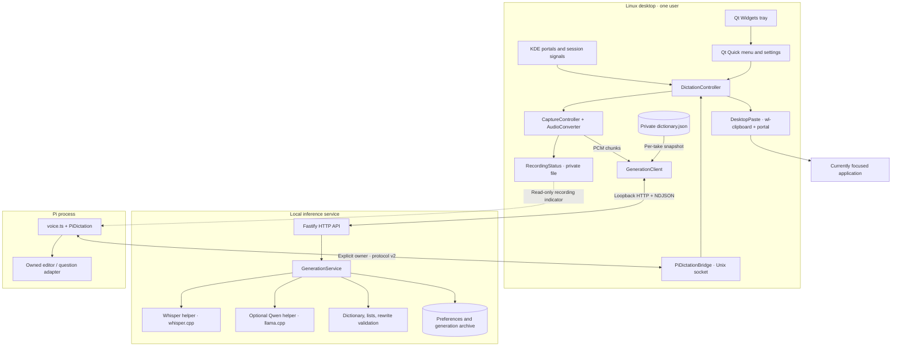
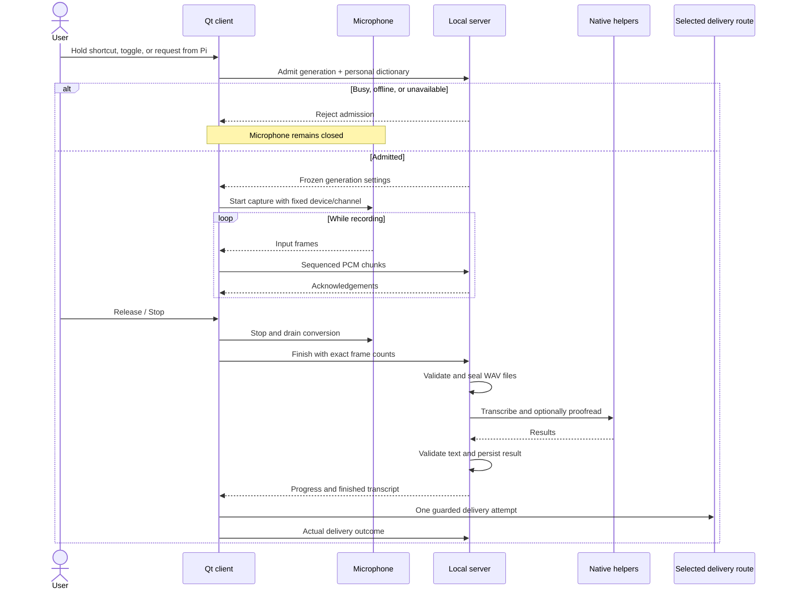
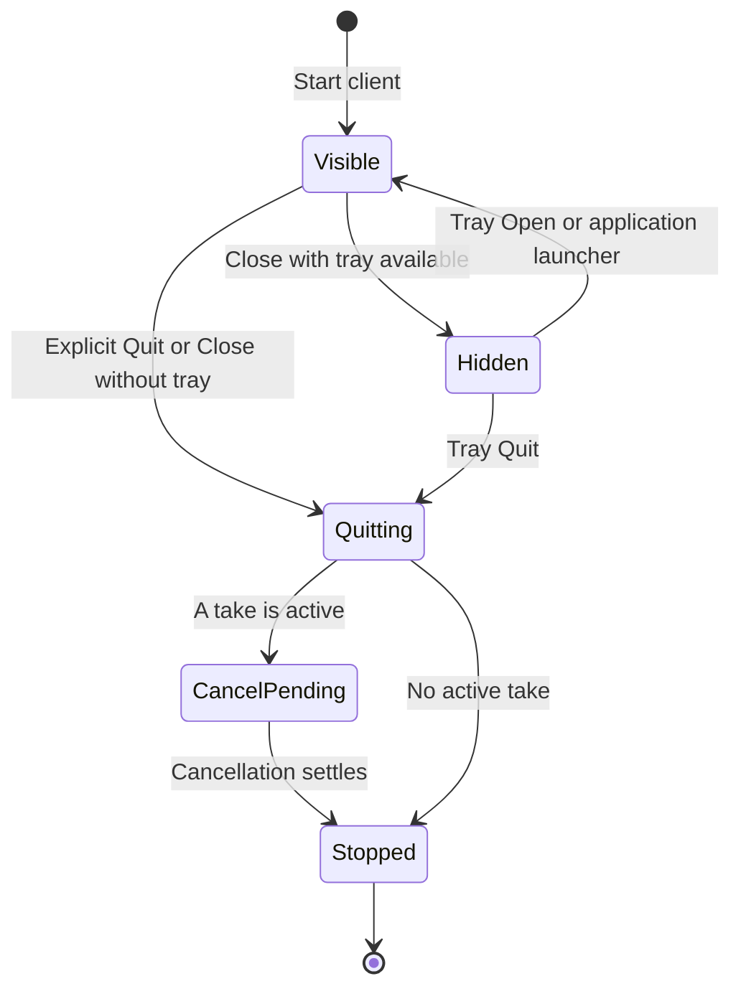

# Architecture

cotto has two long-lived application processes: a native Qt desktop client and an
independent local inference server. The server supervises two native helpers.
The UI does not load models, and the helpers do not access the microphone, desktop,
clipboard, or Pi editor.

## System map



The two delivery routes are intentionally separate. A failed Pi-owned take never
falls back to global paste. The recording-status file is observation only; it does
not identify a destination or grant control of capture or insertion.

## Component ownership

| Component | Responsibility |
| --- | --- |
| [`Linux/src/main.cpp`](../Linux/src/main.cpp) | Composition root: connects capture, transport, desktop services, tray, and QML. |
| [`Main.qml`](../Linux/qml/Main.qml) / [`TrayController`](../Linux/src/TrayController.h) | Compact menu and settings; hide/reopen/quit policy and native tray. No inference logic. |
| [`CaptureController`](../Linux/src/CaptureController.h) | Input selection, channel selection, microphone test, capture limits, and device-loss handling. |
| [`AudioConverter`](../Linux/src/AudioConverter.h) / [`PcmMeter`](../Linux/src/PcmMeter.h) | Frame-boundary handling, selected-channel metering, and libsamplerate conversion to mono 16 kHz float32. |
| [`DictationController`](../Linux/src/DictationController.h) | One active take, explicit ownership, cancellation, and the selected delivery route. |
| [`GenerationClient`](../Linux/src/GenerationClient.h) | Admission before capture; bounded, sequenced audio uploads; completion events and delivery receipts. |
| [`DesktopShortcuts`](../Linux/src/DesktopShortcuts.h) / [`DesktopPaste`](../Linux/src/DesktopPaste.h) | KDE shortcuts and lock/suspend signals; permissioned, guarded clipboard staging and paste dispatch. |
| [`PersonalDictionary`](../Linux/src/PersonalDictionary.h) | Validated per-user words, owner-only atomic persistence, and fresh admission-time snapshots. |
| [`PiDictationBridge`](../Linux/src/PiDictationBridge.h) | Private same-user socket, one owner, one-use take IDs, deadlines, and receipt handling. |
| [`Linux/integrations/pi`](../Linux/integrations/pi) | Pi editor ownership, draft/cursor/revision checks, shortcut lifecycle, preferences, and recording observation. |
| [`Server/src/main.ts`](../Server/src/main.ts) | Server entry point, configuration, archive lock, HTTP lifecycle, and helper supervision. |
| [`GenerationService`](../Server/src/generation-service.ts) | Serialized admission, frozen settings, audio sealing, inference/text pipeline, durable results, and history. |
| [`Engine`](../Engine) / [`TextEngine`](../TextEngine) | Separate persistent C++ processes for Whisper and Qwen; CPU or optional CUDA. Separate builds avoid conflicting ggml versions. |

## A recording



Inference audio is mono 16 kHz little-endian float32. Optional original audio
preserves the input rate and channels as float32. Each stream has its own sequence
and acknowledgements; final frame counts must match the accepted recording.
The server accepts complete takes from 0.25 to 180 seconds.

Cancellation invalidates the active transaction and stops capture. Stale callbacks
cannot deliver into a later take. There is no offline recording queue and no
automatic replay of failed or uncertain insertion. A complete upload may finish
on the server after disconnection; reading its history does not insert it.

## Delivery boundaries

### Global focused-app paste

KDE grants keyboard-only portal access. `wl-copy` owns the staged clipboard while
`wl-paste` verifies it; the portal sends a fixed Ctrl+Shift+V chord. Cotto validates
text, tracks clipboard ownership changes, and makes one attempt. It does not type
arbitrary key sequences or send Enter.

This route **does not prove the destination field or confirm insertion**. Keep the
destination focused and release shortcut modifiers. Uncertain delivery retains the
transcript for explicit recovery; it is never automatically retried.

### Pi-owned insertion

Pi takes a snapshot of the requesting editor before connecting. The bridge issues
a random, single-use UUID in its protocol-v2 hello. Only that connection can start
that ID, and it is consumed before capture is requested. Each later take uses a
new connection and ID: there is no lifetime replay cache or 4,096-take limit.

Before insertion, Pi checks the same editor instance, revision, text, cursor,
focus/modal state, and session ownership. It inserts through the editor adapter,
not terminal keystrokes. Missing receipts are uncertain, not grounds to retry.

## Process and window lifecycle



Hiding preserves active dictation and unsaved dictionary edits; a microphone test
stops on hide. The app-menu launcher starts the managed client if necessary and
calls its D-Bus `Show` method. That activation endpoint cannot request capture or
quit the client.

Quitting the client leaves inference running. Optional systemd **user** services
manage startup and bounded failure restarts. Installing them does not enable login
startup. KDE keyboard permission remains session-only. See [startup](linux/STARTUP.md).

## Text processing

The server runs Whisper → mechanical cleanup → dictionary → list formatting →
optional Qwen → dictionary → rewrite validation → composition. A failed or rejected
rewrite retains the pre-proofreading text. Model hints are bounded and cannot
license arbitrary rewrites. See [dictionary and cleanup](text-correction.md).

Helpers communicate over bounded JSON-lines pipes, retain warm models, and are
replaced after protocol errors, cancellation, or deadlines. The server verifies
pinned local model files; helpers have parent-death cleanup. No runtime model
download, cloud fallback, or credentialed provider request occurs automatically.

## Storage

| Scope | Storage | Boundary |
| --- | --- | --- |
| User/device settings | Qt settings under the selected `XDG_CONFIG_HOME` | Microphone and other device-local configuration. Existing Sotto identifiers remain stable. |
| Personal dictionary | `$XDG_CONFIG_HOME/Sotto/Sotto Linux Dev/dictionary.json` | Validated, owner-only, atomic saves. Empty means empty; no shared vocabulary inheritance for that take. |
| Pi preference | Pi's user configuration | Enable/disable state, not transcript storage. |
| Live recording indicator | `$XDG_RUNTIME_DIR/cotto-status/recording.json` | Private, timestamped, expiring boolean; no text or device identity. |
| Pi bridge | `$XDG_RUNTIME_DIR/sotto-dictation/input.sock` | Explicit `--pi-dictation` only; private directory and same-user peer check. |
| Server data | Configured `--data-dir` | Shared server preferences and durable generation artifacts, protected by one advisory directory lock. |

```text
<data-dir>/
  .server.lock
  preferences.json
  generations/<UUID>/
    metadata.json
    transcript.txt
    inference.wav
    original.wav       # only when retention was enabled
```

Admission snapshots personal words into **that generation**, replacing its shared
dictionary/vocabulary hints without modifying shared preferences. This is
configuration isolation, not a multi-user authentication system: the generation
archive retains those words and other take metadata. Data routes use the server's
access policy, not per-account ACLs.

Completed inference audio and transcripts remain until explicitly deleted.
Original-audio retention defaults on in server preferences; changing it affects
future takes only. There is no automatic expiry or filesystem encryption. Logs
must not contain transcripts or audio. Protect and back up the archive accordingly.

## Supported scope

KDE/Wayland is the desktop target. The server and helpers build for Linux x64 and
arm64; CUDA is optional. The Linux client currently permits loopback server URLs,
even though the server API can be configured for authenticated remote access.
First-party Swift/macOS code, packaging, and CI are removed. Vendored libraries
remain unmodified and may contain upstream code for other platforms.

The [OpenAPI contract](../Server/api/openapi.yaml), [HTTP guide](client-server-contract.md),
and [test gates](linux/TESTING.md) define the integration boundaries. Physical
shortcut, lock/suspend/unplug, fresh-login, and acoustic acceptance are separate
from provider-free automated tests; see [status](linux/STATUS.md).
