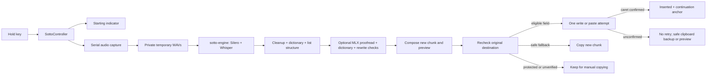

# Architecture

Sotto is a native SwiftUI/AppKit application packaged as a macOS `.app`. SwiftPM builds the app and core library; CMake builds the speech helper, and Xcode builds the Swift MLX text helper and Metal shaders. The runtime targets Apple Silicon and macOS 14+, while building requires the macOS 26+ SDK and Metal Toolchain. There is no web view, Python runtime, HTTP server, or bundled model weight in the repository.

## Components and data flow

| Component | Responsibility |
| --- | --- |
| `SottoCore` | Deterministic text cleanup, dictionary/list formatting, continuation state, rewrite checks, audio metering, microphone selection, model integrity, configuration/archive formats, and lifecycle policy. No AppKit dependency. |
| `SottoController` | Coarse session state, take-scoped settings, microphone startup, model warm-up, processing, delivery, history, and cancellation. Session IDs prevent stale tasks from affecting a newer take. |
| `System` | Passive global hotkey tap, Core Audio inventory/capture, permissions, off-main Accessibility destination capture, and guarded clipboard/text delivery. |
| `EngineClient` / `sotto-engine` | A persistent native child with Whisper/Silero contexts, one inference request at a time, and private JSON-lines pipes. Validates mono 16 kHz PCM16/float32 WAV input; uses Metal/Accelerate and no-speech filtering. |
| `TextCorrectionService` / `TextCorrectionClient` / `sotto-text-engine` | Optional, separately managed native Swift MLX proofreading. Loads only a verified local model directory; communicates through private pipes, not a network endpoint. |
| `ModelStore` / `TextModelStore` | Explicit downloads, streaming progress, off-main SHA-256 verification, atomic installation, cancellation, and failure cleanup. |
| `ConfigurationStore` / `DictationHistoryStore` | Observable preferences and asynchronous ownership of durable archive writes. File formats and validation live in `SottoCore`. |
| `RecordingFeedback` | Nine recent meter samples and a whole-second clock, observed independently of the dashboard's coarse state. |

The speech model is Whisper large-v3-turbo. Text correction uses a pinned, six-file MLX 4-bit Qwen3-4B-Instruct-2507 directory. Model URLs, revisions, sizes, and checksums are defined by `SpeechModel` and `TextModel`; text-engine package versions are pinned in `TextEngine/Package.resolved`. Explicit model downloads are the app's only runtime network feature.

## Native presentation

- **Main window:** `SottoWindowView` uses `NavigationSplitView` with six pages: Dictation, Microphone, Dictionary, History, Models, and General. The sidebar has a 224-point ideal width; page content is capped at 700 points. Native controls, concise grouped rows, and fixed state/action slots avoid layout jumps. Window geometry is restored, and the native titlebar remains opaque to scrolled content.
- **Appearance:** warm light surfaces and a cool slate/ice-blue Glacier dark palette adapt to system appearance and increased contrast. Floating surfaces use Liquid Glass on macOS 26+, native materials on earlier systems, and opaque accessibility fallbacks for Reduce Transparency/increased contrast. Glass is applied to a passive background where needed so it does not obscure the foreground content. Reduce Motion disables waveform interpolation and hover transitions.
- **Listening indicator:** a 200 × 46-point nonactivating `NSPanel` shows the ribbon logo, waveform/processing/result symbol, and duration. Hover or keyboard/accessibility focus reveals × in the same duration slot. It cannot become key or main, does not hide on deactivation, and joins full-screen spaces and Stage Manager sets. Placement follows the pointer's display; showing it does not activate Sotto.
- **Menu bar:** a fixed 28-point status item uses cached native template artwork: logo when idle, waveform while starting/recording, and dots while processing/delivering. `SottoMenuView` is 300 points wide. The hotkey prompt and actionable status guidance share one fixed slot; the microphone-name test button and transcript/copy preview stay aligned across states.
- **Popover placement:** content is measured before presentation, then the hosting frame, preferred size, and popover size are set together. Hosting `sizingOptions = []` prevents a late resize from moving the panel above its anchor. The status button's flipped coordinates determine the physical bottom edge; AppKit fits the popover on screen without manual window offsets.

`DictationActivity` distinguishes `starting`, `recording`, `transcribing`, and `delivering`; all remain busy until their work ends. Confirmed insertion, copying, testing, list-only updates, unconfirmed insertion, and failure have distinct outcomes. Copied or unconfirmed output is not shown as an insertion-success checkmark.

## Recording and model lifecycle

1. **Accept the hold.** Fn/Globe starts on its first valid flags-down or nonrepeat key-down edge, without waiting for a hardware-state poll. An accepted Fn hold survives clicks, scrolling, typing, modifiers, and Escape. Fn release finishes; the explicit × cancels. Escape can cancel processing after release or a button-started test. Right Option/Control retain a 180 ms chord filter so ordinary modifier shortcuts still work.
2. **Start independently.** The controller enters `starting` and shows the HUD before awaiting the microphone. Cached device inventory resolves the input. `AudioCaptureWorker` validates permission/device state and performs AVAudioEngine/HAL setup on its serial queue. Model warm-up and detached system-wide Accessibility capture run alongside it. Slow model loading or external AX metadata does not delay the initial indicator.
3. **Stop admission on release.** Release synchronously closes the audio-admission gate before asynchronous teardown. Only admitted buffers are drained/converted and finalized. Holds or usable audio shorter than 0.25 seconds cancel quietly; a take is capped at 180 seconds. Release during startup cannot restart capture, and old callbacks cannot stop a newer session.
4. **Process the take.** One speech inference request produces text, which passes through deterministic formatting and optional proofreading. Dictionary, correction-enabled state, input route, and retention settings are snapshotted for the take. Configuration edits affect later takes rather than changing processing midway.
5. **Deliver once.** Destination capture must have observed the actual field/caret no later than release; slower role/menu metadata may finish afterward. Final focus, selection, protection, modifier, and clipboard checks precede a single insertion attempt. Only caret confirmation reports insertion and advances external list state.
6. **Settle and retain.** Completed results can transfer capture-file ownership to the archive writer. Temporary copies are removed after the archive attempt or immediately for unsaved/cancelled takes. The HUD reflects the actual outcome, and warm-idle deadlines begin.

The microphone is never pre-opened while idle; real hardware startup latency still exists. Sleep, lock, input failure, and cancellation can safely interrupt capture even during a held key.

Both model clients coalesce concurrent load requests and fence stale callbacks with generation/operation IDs. They bound requests, pipes, and timeouts; cancellation resolves pending work and terminates active or loading helpers. Cancelling a take preserves an already-ready idle model. Helper shutdown includes process termination safeguards, and the speech helper watches parent death.

The shared memory policy unloads immediately, after five or fifteen idle minutes, or on quit. Unloading ends the helper process without deleting weights. Idle memory pressure unloads models; it does not silently discard active inference. Sleep, lock, and quit release both helpers. Disabling text correction unloads it when idle while an active take retains its saved policy. The MLX shader library and dependency resources are bundled next to `sotto-text-engine`, so runtime loading does not depend on build directories.

## Input routing and feedback

`AudioDeviceStore` observes usable Core Audio inputs, stable UIDs, names, transport, and route/default changes. Inventory reads do not open audio, request microphone permission, or alter the system default. Transient `AudioDeviceID` handles stay inside the hardware layer.

`MicrophoneSelectionPolicy` is pure: Automatic selects the first connected UID in the active named priority list, then the available system input, then a stable available fallback. System default ignores priorities. Fixed mode prefers its saved UID and returns to it on reconnection. Disconnected favorites retain their saved positions; empty inventory resolves to no microphone.

The recorder sets its own input AudioUnit's device before reading the format, then pins that route and PCM format for the take. Preference edits or a better microphone reconnecting affect future recordings only. Unrelated hardware events keep the current route; loss, format changes, or failed same-route recovery interrupt instead of switching sources mid-sentence.

`HotkeyMonitor` installs a passive session event tap on common run-loop modes. A two-second health check inspects permission fingerprints and tap validity, not idle keys. Recovery cancels pending/active holds and requires a fresh release before another press. Key-state polling is limited to held-key gating, release recovery, and delayed Option/Control validation; it does not delay Fn's accepted first edge. Accessibility is sufficient; separate Input Monitoring is not required. General's audio-free **Check shortcut** retains at most 16 diagnostic lines for a 60-second check, without typed characters or audio.

The capture writer meters exact 800-frame windows of normalized 16 kHz PCM: 20 updates per audio second. RMS maps from −68 to −18 dBFS with 20 ms attack and 130 ms release. This changes display levels, not gain or saved samples. `RecordingFeedback` publishes nine actual recent readings, suppresses settled-silence updates, and changes the clock only once per whole second; it does not refresh the whole dashboard at audio frequency.

## Formatting and proofreading

The processing order is **Whisper → light cleanup → dictionary → deterministic lists → optional MLX proofread → dictionary again → rewrite checks → composer → delivery**.

- `PersonalDictionary` uses validated, always-active named lists. Preferred spellings and explicit aliases match whole words/phrases case-insensitively with Unicode boundaries and longest-match ordering. Replacements use the original input once, so they cannot cascade. Preferred terms supplement Whisper's vocabulary hints. There is no fuzzy replacement or learning from later editor changes.
- `SpokenListFormatter` recognizes explicit start/resume/end directives, numbered/ordinal markers, and bullets. It preserves item content and explicitly spoken numbering. Optional proofreading cannot create or advance list context.
- `DictationComposer` separates the new insertion chunk from the potentially accumulated preview. New list takes add newlines; ending a list defers a paragraph break until prose arrives. Control-only commands never send whitespace-only pastes or Return.
- Qwen sees only the new dictated chunk and bounded preferred-term hints—not surrounding text, screenshots, clipboard history, or earlier preview text. `TextCorrectionPolicy` limits input to 6,000 characters; the helper bounds context and output to 8,192 and 2,048 tokens.
- Rewrite checks reject changed list markers, protected quantities/negation/dictionary terms, excessive wording changes, control tokens, and added response commentary. These are heuristics, not semantic proof. Missing models, timeouts, failures, long input, and rejected output return the already-formatted source with a recorded outcome.

External continuation belongs to an exact process/AX-element identity and collapsed UTF-16 caret left by confirmed insertion. Moving the cursor, missing metadata, or unconfirmed/failed delivery prevents advancement. State is bounded to eight anchors with a 15-minute lifetime and clears on Clear, sleep, lock, and quit. In-app tests use separate state and never paste or alter the clipboard. Clipboard copies contain only the new chunk, not an accumulated list preview. See [text correction](text-correction.md) for model provenance and limitations.

## Delivery and clipboard safety

`TextInserter.beginDestinationCapture()` reads system-wide `AXFocusedApplication` and `AXFocusedUIElement` off-main. It keeps application and remote element-owner PIDs separate, timestamps the actual field/selection observation before slower ancestry/menu discovery, and never reads document text. AX calls have bounded timeouts; cancellation prevents subsequent reads but cannot interrupt an in-flight IPC.

A field/caret first captured after release cannot become a paste target. Missing/noneditable fields or safely verified ordinary focus/caret changes can select clipboard delivery. Protected, mixed-ownership, or unverified destinations stay in the manual preview. Sotto never activates a previous app or presses Enter.

Native single-line `AXTextField`/`AXComboBox` controls may use `AXSelectedText` replacement after bounded ancestor inspection rules out a web area. Rich/web editors and text areas use paste first. `NativePasteCommand` finds a unique Command-V menu action using command metadata and bounded traversal, not localized titles. A targeted Command-V fallback is allowed only if no prior menu action was attempted. Final dispatch rechecks focus/caret, protection, modifiers, trust, and clipboard ownership.

`TextDeliveryTransaction` treats an acknowledged write, timeout, or dispatched paste as an attempt, not success. It polls caret metadata for the exact expected UTF-16 position and never retries a write that may have landed. Missing/inconclusive caret data yields **Insertion unconfirmed**, no continuation anchor, and a bounded paste-consumption wait before restoring temporary clipboard data. Cancellation after dispatch cannot undo a write that already occurred.

The temporary paste lease snapshots clipboard representations up to 32 MB, stages current-host-only transient text, and restores the snapshot only while it owns that clipboard revision. New user copies always win. Intentional copies and safe unconfirmed-insertion backups are persistent, current-host-only copies of the new formatted chunk; they never overwrite a newer user copy. Blocked/failing paths retain the preview, and cancellation creates no backup. In-app microphone tests bypass automatic delivery entirely.

## Configuration and storage

`SottoConfiguration` defines validated preferences. The `ConfigurationFile` actor handles bounded reads, migration, and private atomic writes. Edits merge changed top-level fields into the latest disk object, preserving unrelated changes and unknown top-level keys; file identities and bounded retries protect against conflicts. Ordinary edits do not overwrite invalid or missing configuration.

`ConfigurationStore` supplies one observable snapshot to the controller and feature stores. Startup loads it before services/hotkeys start. UI edits batch for 150 ms off-main; failed saves restore the valid snapshot and show an error. File/directory vnode watchers handle in-place and atomic external saves without periodic polling or key-down disk reads. Active takes retain their settings snapshot. macOS owns permissions, login-item approval, and native window placement.

| Data | Location |
| --- | --- |
| Configuration | `~/.murmur/config.json` |
| Transcript/audio archive | `~/.murmur/transcripts/` |
| Whisper weights | `~/Library/Application Support/Murmur/Models/` |
| MLX correction weights | `~/.murmur/models/Qwen3-4B-Instruct-2507-MLX-4bit/` |

Legacy storage paths and the `dev.davis.murmur` bundle/signing identity intentionally remain stable for existing data and macOS permissions. Current app/module names are `Sotto` and `SottoCore`; helper executables are `sotto-engine` and `sotto-text-engine`.

History is enabled by default and snapshotted at take start. `DictationHistoryStore` enqueues immutable results and owns their temporary audio until `DictationArchiveWriter` finishes. The writer uses private descriptor-relative files/directories, symlink checks, and exclusive atomic publication without overwriting existing takes. Records contain raw ASR/final chunk, timestamps, model/microphone/options, timings, delivery outcome, and optional dictionary/proofreading provenance; audio includes original input PCM and the inference WAV. Cancelled takes are discarded. Archive failures are visible but do not undo successful delivery; normal quit drains pending jobs, while crashes cannot guarantee pending-take preservation.

The History page loads archive metadata on demand in batches of 200, rather than reading personal transcripts during app startup. It supports reading/copying text, revealing folders, and opening audio in the default player; browsing does not rewrite archives. Clearing the current preview does not delete history. Files remain until the user deletes them and are private to the local user, not additionally encrypted by Sotto.

See [configuration](configuration.md) and [local history](local-history.md) for validation, recovery, schemas, and retention details. Sotto has no remote inference, telemetry, unattended transcription, surrounding-text capture, or automatic learning from later edits. Editor accessibility and audio drivers vary; no implementation check establishes universal compatibility or zero hardware latency.
