# Architecture

Sotto has a native macOS client and an independent HTTP server for macOS or Linux. The server owns processing and durable product state. Running both on the same Mac uses the same API as connecting to another machine; the client never starts or stops the server.

```mermaid
flowchart LR
    Key[Hold key] --> Accept[Server accepts generation]
    Accept --> Capture[Mac microphone capture]
    Capture --> Upload[HTTP PCM chunks]
    Upload --> Store[Server audio storage]
    Release[Release key] --> Finish[Finish acknowledged upload]
    Store --> Finish
    Finish --> Whisper[Whisper recognition]
    Whisper --> Rules[Cleanup, dictionary, lists]
    Rules --> Qwen[Optional Qwen proofread and guards]
    Qwen --> History[Server result and history]
    History --> Events[NDJSON progress and final result]
    Events --> Delivery[Mac checks destination and inserts once]
```

## Ownership

| Component | Responsibility |
| --- | --- |
| `Sotto` | SwiftUI/AppKit interface, server connection, device identity, microphone/hotkey controls, temporary upload buffering, ephemeral cursor anchors, guarded delivery. |
| `SottoCore` | Mac device preferences, microphone selection/metering, and native support types. |
| `SottoAPI` | Shared Codable wire types and protocol limits. |
| `SottoDomain` | Portable deterministic cleanup, dictionary rules, list structure, rewrite checks, and composition. |
| `SottoServerKit` | Hummingbird routes, authentication, generation admission/state, storage, shared preference revisions, model/helper lifecycle. |
| `sotto-server` | Independent runner with explicit bind address, data directory, model/helper paths, and optional token file. |
| `sotto-engine` | Persistent whisper.cpp/Silero helper, with Metal on Mac and optional CUDA on Linux. |
| `sotto-text-engine` | Persistent Qwen helper: Swift MLX on Mac, llama.cpp/GGUF on Linux. |

Native helpers communicate with the server over bounded private JSON-lines pipes. The two C++ engines build separately because they use different ggml versions. The native app contains no model helpers. There is no Python runtime dependency.

## Session lifecycle

1. The Mac checks permissions/input availability and asks the server to create a generation with its device ID/name. The server snapshots shared preferences and accepts one active recording/processing job at a time. Offline, warming, storage-full, and busy states prevent microphone capture.
2. The client captures through input-only AUHAL on a serial queue. It pins the selected microphone for the take and produces normalized mono 16 kHz float32 PCM. If retention is enabled, it also uploads interleaved float32 PCM at the original microphone rate/channel count.
3. Audio arrives through bounded HTTP requests with independent per-stream sequence numbers. The client observes acknowledgements and bounded backpressure. The server checks formats, frame alignment, samples, duration, and disk space. A repeated identical chunk is idempotent; missing or conflicting chunks fail.
4. Releasing the key closes audio admission before teardown. The client drains capture and upload work, then submits exact final frame counts. The server verifies both intervals and seals complete WAV files before inference. Takes must be 0.25–180 seconds.
5. The server transcribes the whole take, applies deterministic processing and optional proofreading, then saves the result. An NDJSON response carries full generation snapshots, progress, and two-second heartbeats. It is progress streaming, not incremental transcription or token insertion.
6. The originating live client rechecks its destination and makes one delivery attempt. It reports the actual insertion/copy/test outcome to the server separately from processing completion.

A failed connection during capture/upload stops the take and discards client temporary data. The server expires abandoned partial uploads. There is no offline queue or manual retry workflow. A completely uploaded generation can finish after a client quits or disconnects; later history reads never initiate delivery. A server restart marks unfinished generations failed and preserves already-completed history.

Models warm at server startup and remain loaded for reuse. There is no idle-unload preference. Cancellation stops active helper work and fences stale responses; the server warms again as needed. A missing or failed proofreader preserves usable deterministic text, while unavailable speech recognition prevents recording admission.

## Processing and delivery safety

The server pipeline is **Whisper → cleanup → dictionary → deterministic lists → optional Qwen → dictionary → rewrite checks → composer**. Model output cannot create list continuation state. Rejected proofreading retains the already-formatted source; the generation records the outcome and reason.

The composer distinguishes the new `insertionText` from an accumulated `previewText`. Only the former is eligible for insertion. List continuation uses a previous completed generation ID from the same device plus an exact client-side confirmed cursor anchor; server checks include delivery state, mode, and age. Accessibility handles and surrounding editor text never cross the API.

Destination capture must observe the field/caret by release. Before delivery, the Mac checks focus, selection, protected fields, held modifiers, and clipboard state. A caret-confirmed write advances continuation; copied or unconfirmed output does not claim insertion success. A changed or unsafe destination falls back to clipboard or manual preview as appropriate. Reconnection and browsing history cannot trigger a delayed paste.

## Native capture and presentation

- A passive global hotkey tap supports Right Option, Right Control, and Fn/Globe. The microphone is never opened while idle. Release, explicit cancellation, sleep/lock, device loss, and render errors end capture safely.
- Core Audio input routing never changes the system default device, output device, hardware sample rate, or playback volume. Preferred microphone reconnects affect the next take, not the active one.
- Meter updates are separate from coarse dashboard state. Native window, menu, and floating indicator show **Dev** and expose server readiness/progress.
- Device configuration, window state, Keychain credentials, and privacy permissions use the independent `dev.davis.sotto.dev` app identity.

## Storage and deployment boundary

The server data directory contains shared preferences and per-generation metadata, transcript text, and audio. Clients read the same history over HTTP, with origin-device tags. Only one runner may own a data directory; durable storage and process supervision belong to the server deployment.

A loopback endpoint works for same-Mac use. Remote use accepts an explicitly configured HTTP or HTTPS endpoint with bearer authentication; use HTTPS for public hosting or HTTP over a private Tailscale connection. Tailscale is an access option, not an application dependency. macOS uses native Metal/MLX; Linux offers x86_64/ARM64 builds with CPU or optional NVIDIA CUDA. GPU support and latency need validation on the eventual host.

Sotto's service health/process boundary can be observed by fleet tooling, but notification routing and a central fleet information service are separate products. Sotto owns its own sessions, settings, and inference state.

See the [HTTP contract](client-server-contract.md), [shared history format](local-history.md), and [server runner guide](../Server/README.md).
